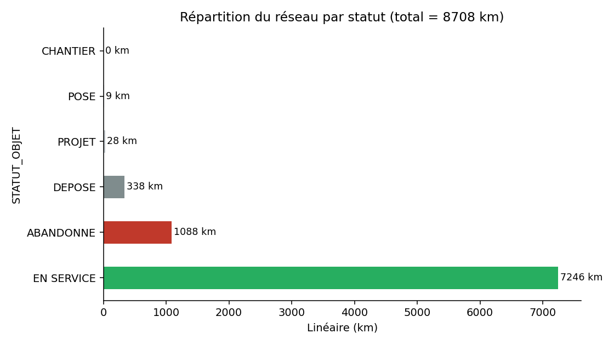
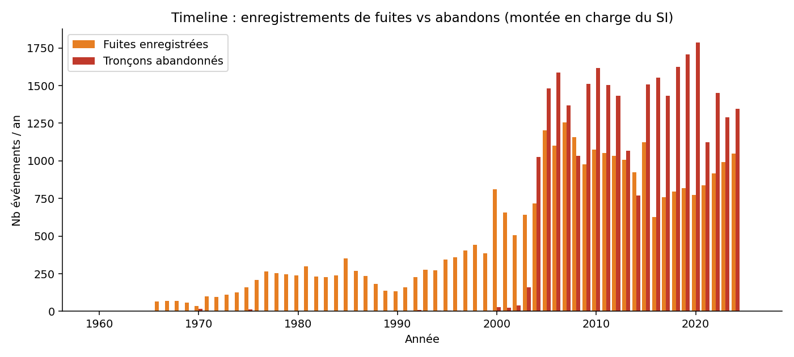
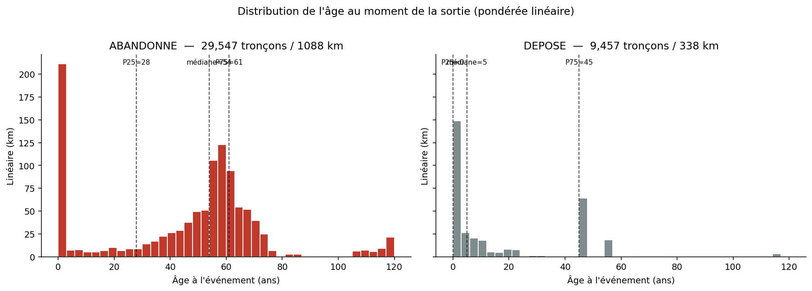
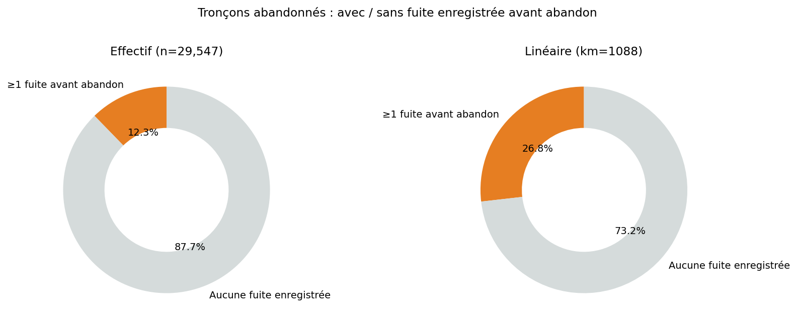
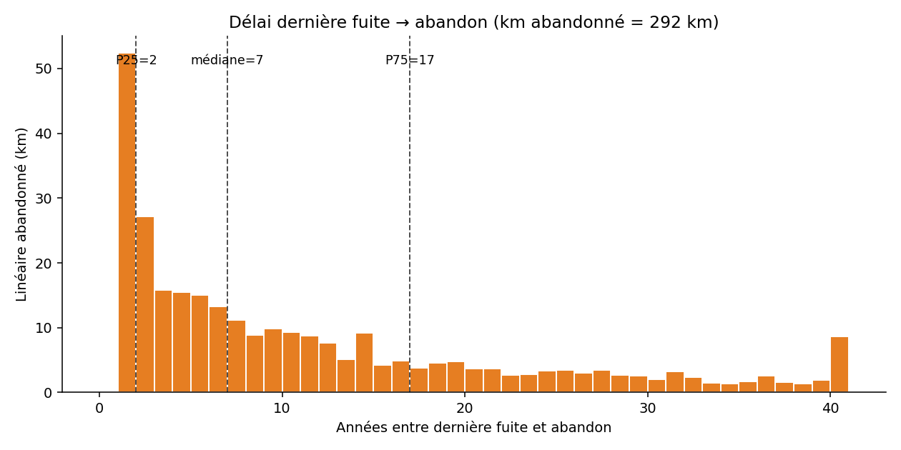
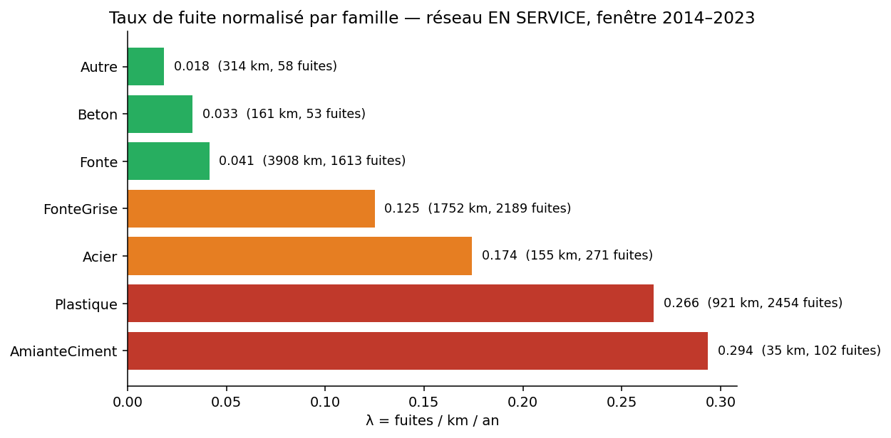
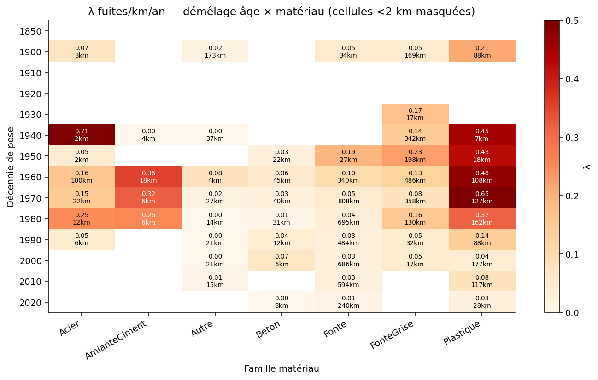
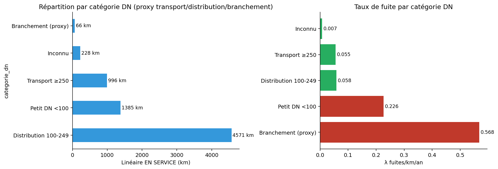
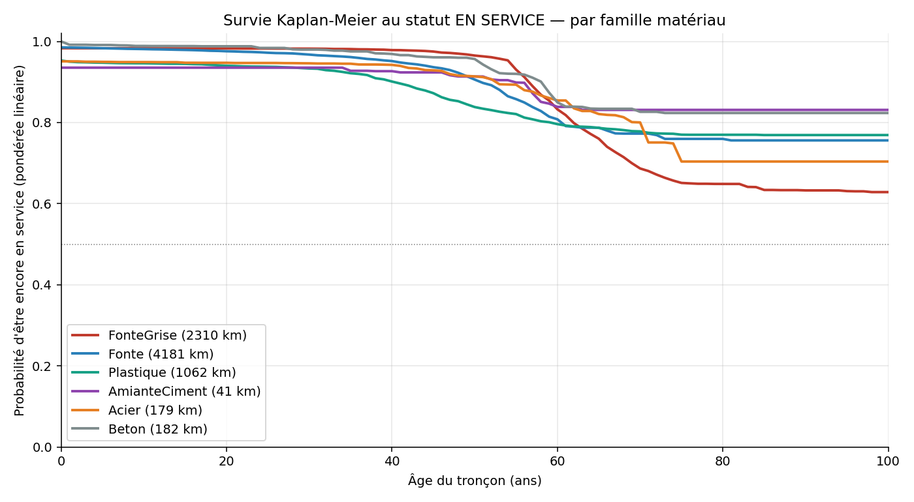

# Analyse statistique — Anomalies, abandons et risque de fuite

**Périmètre :** réseau SEM (canalisations eau)
**Année de référence :** 2024
**Méthodologie :** toutes les statistiques sont **pondérées par le linéaire (m)**.
Les distributions asymétriques sont caractérisées par **médiane + IQR**, pas par la moyenne.
Les taux de défaillance sont **normalisés par exposition** (`λ = fuites / km / an`).

---

## 0. Cadrage du périmètre



| Statut | n tronçons | Linéaire (km) | % |
|---|---:|---:|---:|
| EN SERVICE | 182 075 | **7 246** | 83.2 % |
| ABANDONNE | 29 547 | 1 088 | 12.5 % |
| DEPOSE | 9 457 | 338 | 3.9 % |
| Autres (projet, posé, chantier) | 878 | 37 | 0.4 % |
| **Total base** | **221 957** | **8 708** | 100 % |

> ⚠️ **Écart au CR du 10/04** : 8 708 km vs **6 661 km annoncés**.
> Hypothèses possibles : le CR exclut les abandonnés (→ 7 620 km, encore +14 %), ou bien la base contient des objets autres que la distribution eau pure (transport ? regards ? appareillages ?).
> **Action requise** : clarifier avec la SEM le périmètre précis des 6 661 km — sans cela tous les KPIs « % du linéaire » sont incorrects (incluant le `km_total_reseau: 100` codé en dur dans `app/config.yaml`).

---

## 1. Qualité des dates de pose — un angle mort majeur

| Anomalie | n tronçons | Linéaire |
|---|---:|---:|
| `annee_pose = 1900` (date par défaut/sentinelle) | 17 340 | **513 km** |
| `annee_pose` manquante | 588 | 28 km |
| **Total dates non fiables** | **17 928** | **541 km** |

**6.2 % du linéaire total (et ~7.5 % du EN SERVICE) a un âge inexploitable**. Le modèle V9 utilise un flag `age_imputed` + médiane par famille pour combler — c'est correct techniquement, mais **541 km de données quasi-aveugles, c'est massif**. Pour le tableau de bord et la matrice de risque, ces tronçons doivent être traités séparément (« âge inconnu » ≠ « âge = médiane »).

---

## 2. Censure historique — le problème est plus fin que la chronologie brute



- **Anomalies** enregistrées depuis 1960, mais P25 = 2000, médiane = 2008. L'historique avant 2000 est creux (~250 enregistrements/an, vs 1 000+ après 2005).
- **Abandons** : 95 % postérieurs à 2005 (P5 = 2005, P95 = 2023).

> ✅ **La censure à gauche n'est pas le facteur dominant** : seulement 3.5 km de tronçons abandonnés avant 1984.
> 🟠 **En revanche**, les abandons 2005-2010 (≈ 380 km) couvrent une période où la capture des fuites montait en charge — leur historique « sans fuite enregistrée » est partiellement non-fiable.

---

## 3. ABANDONNE ≠ DEPOSE — confusion sémantique du rapport initial



| | n | km | Âge à l'événement (médiane) | IQR | Lecture métier |
|---|---:|---:|---:|---|---|
| **ABANDONNE** | 29 547 | 1 088 | **54 ans** | [28 ; 61] | Vraie fin de vie patrimoniale |
| **DEPOSE** | 9 457 | 338 | **5 ans** | **[0 ; 45]** | Réajustement SIG / chantier tiers |

> ⚠️ **3 865 tronçons abandonnés ont un âge nul** (annee_pose = annee_abandon, soit **202 km — 18.5 % du linéaire abandonné**) → spike anormal sur l'histogramme. C'est très probablement une **convention SIG** (réajustement topologique : un tronçon est « abandonné » et un nouveau le remplace dans la même année, sans qu'il y ait défaillance physique). À **exclure de la cible** au même titre que les déposés.

> ✅ **Conséquence pour le modèle V9** : la cible actuelle (ABANDONNE seul) inclut ces 202 km qui sont du « bruit administratif ». À filtrer par `age_evt > 0` ou par `annee_pose < annee_abandon - 1`.

---

## 4. Le mythe « 89.6 % d'abandons sans anomalie » corrigé en linéaire



| | Effectif (rapport initial) | **En linéaire (vrai)** |
|---|---:|---:|
| ABANDONNE avec ≥1 fuite avant | 12.3 % | **26.8 % (= 292 km)** |
| ABANDONNE sans fuite enregistrée | 87.7 % | 73.2 % (= 796 km) |

**Lecture** : les tronçons abandonnés avec fuite font en moyenne 80 m, ceux sans fuite 31 m. Les longs tronçons (artères, distribution principale) ont vu leur fuite — les abandons « silencieux » sont dominés par des micro-segments (chantiers voirie, raccordements, réajustements).

→ La conclusion « les anomalies ne sont pas le facteur principal des abandons » du rapport initial **reste vraie pour 73 % du linéaire**, mais la magnitude (87 % → 73 %) change l'argument métier.

---

## 5. « 1 fuite déclenche l'abandon » — faux



Délai entre dernière fuite enregistrée et abandon (sur 292 km abandonnés avec fuite) :

| Quantile | Effectif | **Linéaire** |
|---|---:|---:|
| P25 | 3 ans | **2 ans** |
| **Médiane** | 9 ans | **7 ans** |
| P75 | 21 ans | 17 ans |
| ≤ 1 an | 14.8 % | 18.0 % |
| ≤ 3 ans | 28.1 % | **32.7 %** |

**Seul 1 km abandonné sur 5** est abandonné dans l'année qui suit sa dernière fuite. La majorité a sa dernière fuite **7 ans avant** l'abandon.

→ La logique métier dominante n'est **pas réactive** (« une fuite déclenche l'abandon ») mais **planifiée** : les fuites passées contribuent au scoring patrimonial, mais le déclencheur réel est l'opportunité de chantier ou un programme cohorte. Cohérent avec le CR du 10/04 (« renouvellement préventif par cohorte »).

---

## 6. Risque sur le réseau EN SERVICE — λ = fuites / km / an



Fenêtre 2014–2023 (10 ans), réseau EN SERVICE uniquement :

| Famille | km exposé | Fuites obs. | **λ (fuites/km/an)** |
|---|---:|---:|---:|
| **AmianteCiment** | 35 | 102 | **0.294** ⚠️ |
| **Plastique** | 921 | 2 454 | **0.266** ⚠️ |
| Acier | 155 | 271 | 0.174 |
| Fonte grise (FTG) | 1 752 | 2 189 | 0.125 |
| Fonte (autres) | 3 908 | 1 613 | 0.041 |
| Béton | 161 | 53 | 0.033 |
| Autre | 314 | 58 | 0.018 |

> 🔄 **Trois découvertes contre-intuitives** :
> 1. **Le Plastique a un λ 2× supérieur à la fonte grise** — contraire au narratif standard
> 2. **L'Amiante-Ciment domine le ratio** mais le linéaire est marginal (35 km) → impact réseau limité
> 3. **La Fonte « autres » est très saine** (λ = 0.041), 3× moins que la FTG

---

## 7. Démêlage âge × matériau (heatmap)



À cohorte de pose égale (cellules <2 km masquées) :

- **FonteGrise vs Fonte « autres » à âge équivalent** :
  - Pose 1950 : 0.23 vs 0.19 — quasi équivalents
  - Pose 1960 : 0.13 vs 0.10 — léger écart
  - **Pose 1970 : 0.08 vs 0.05** — FTG +60 %
  - **Pose 1980 : 0.16 vs 0.04** — **FTG ×4** ⚠️
- **Le Plastique pose un problème générationnel** :
  - Pose 1960-70 : λ entre 0.45 et 0.65 (cohortes très défaillantes)
  - Pose 2000+ : λ tombe à 0.04-0.08 (qualité moderne acceptable)
  - → Probablement les **PVC première génération** et **PEBD** sont en cause

> ✅ **Implication modèle** : `famille_mat` seul (target encoding actuel) ne capture pas ces effets cohorte. Le modèle XGBoost peut les capter via `decennie_pose × famille_enc`, mais ce serait plus propre de coder explicitement la **cohorte technologique** (ex. `FTG_pre1960`, `FTG_post1970`, `PVC_pre1980`, `PEHD_post1990`).

---

## 8. Catégorisation DN — proxy transport / distribution / branchement



Classification par diamètre nominal (proxy en l'absence de typologie explicite) :

| Catégorie (proxy) | km EN SERVICE | **λ fuites/km/an** |
|---|---:|---:|
| **Branchement** (DN<60 ET longueur<30 m) | 66 | **0.568** ⚠️⚠️ |
| Petit DN <100 | 1 385 | 0.226 |
| Distribution 100-249 | 4 571 | 0.058 |
| Transport ≥250 | 996 | 0.055 |
| Inconnu | 228 | 0.007 |

> 🎯 **Confirmation forte du CR (« 80 % des fuites sont sur les branchements »)** :
> - Le proxy « branchement » concentre **0.57 fuites/km/an** — **10× plus** que la distribution.
> - Mais avec seulement 66 km de proxy branchements identifiables (probablement très sous-estimé), on rate vraisemblablement la majorité du linéaire branchements.
> - Le linéaire branchements réel n'est probablement **pas dans cette base** → action critique : **demander à la SEM le linéaire branchements complet**.

> ✅ **Implication modèle** : aujourd'hui le V9 mélange tous les diamètres. Soit on segmente (un modèle par catégorie), soit on injecte la catégorie comme feature first-class avec interactions.

---

## 9. Survie Kaplan-Meier — par famille matériau



Probabilité d'être encore EN SERVICE à âge donné (pondérée linéaire) :

| Famille | Survie à 50 ans | Survie à 80 ans | Vie médiane atteinte ? |
|---|---:|---:|---|
| FonteGrise | ~ 95 % | ~ 65 % | Non (~63 % à 100 ans) |
| Fonte (autres) | ~ 90 % | ~ 76 % | Non |
| Plastique | ~ 79 % | ~ 77 % | Non (peu d'historique long) |
| AmianteCiment | ~ 84 % | ~ 83 % | Non |
| Acier | ~ 90 % | ~ 70 % | Non |
| Béton | ~ 95 % | — | — |

> 📝 **Aucune famille n'atteint 50 % de mortalité** dans la fenêtre observée → le réseau SEM est **globalement jeune** par rapport à sa durée de vie. L'optimiseur ne peut pas raisonner « durée de vie restante » sans hypothèse extrapolative explicite.

> 🟠 **La courbe Plastique chute prématurément** (cassure autour de 30-40 ans), confirmant les cohortes PVC/PEBD problématiques de §7.

---

## 10. Synthèse — implications pour le modèle V9 et la matrice de risque

### Sur la cible du modèle

| Sujet | Constat | Action |
|---|---|---|
| Cible actuelle = ≥1 fuite dans h ans | Légitime, mais ignore la **gravité** (1 fuite ≠ 5 fuites) | Ajouter une variante `nb_fuites` ou `taux_fuite_normalisé` |
| `STATUT == "ABANDONNE"` comme proxy fin de vie | 18 % du linéaire abandonné est `age=0` (réajustement SIG) | Filtrer `annee_pose < annee_abandon - 1` |
| Délai fuite→abandon = 7 ans | Le modèle « prédit la fuite » mais pas « prédit l'abandon » | Garder l'objectif fuite, c'est le bon |

### Sur les features

| Feature | Problème | Action |
|---|---|---|
| `famille_mat` (TE) | Ne distingue pas les cohortes technologiques (FTG_70 vs FTG_50, PVC_70 vs PVC_2000) | Créer `cohorte_techno = famille × decennie` ou laisser XGBoost l'apprendre via interaction explicite |
| Catégorie DN absente | Branchements (λ × 10) noyés dans la distribution | Ajouter `categorie_dn` |
| Linéaire branchements | Probablement absent de la base | **Bloquant — à clarifier avec la SEM** |
| Aléa argile (V9) | Présent mais ΔAUC modeste | Ajouter aussi proximité assainissement, haute tension (cf. CR) |

### Sur la matrice de risque (CR §1.3)

Le V9 produit aujourd'hui **une seule dimension** = `score × longueur` (espérance de fuites évitées). Le CR demande hydraulique, financier, politique, paramétrables. À implémenter comme :

```
Risque_total = w_fuite × P(fuite) × longueur          # axe technique
            + w_hydro × criticité_hydraulique         # impact débit/pression
            + w_fin   × coût_réparation_attendu       # axe économique
            + w_pol   × sensibilité_localisation      # axe politique (école, hôpital, tramway)
```

avec `w_*` paramétrables — exactement ce que demande Lionel.

---

## Annexe — fichiers générés

| Fichier | Contenu |
|---|---|
| `01_repartition_statut.{png,csv}` | Décomposition réseau par statut |
| `02_timeline_capture.png` | Chronologie fuites vs abandons |
| `03_age_sortie_dist.png` + `03_abandonne_vs_depose.csv` | Distributions âge ABANDONNE/DEPOSE |
| `04_abandon_avec_sans_fuite.png` | % linéaire avec/sans fuite avant abandon |
| `05_delai_fuite_abandon.png` | Histogramme délai dernière fuite → abandon |
| `06_lambda_par_famille.{png,csv}` | λ fuites/km/an par famille |
| `07_lambda_cohorte_famille.{png,csv}` | Heatmap cohorte × famille |
| `08_categorie_dn.{png,csv}` | Répartition + λ par catégorie DN (proxy) |
| `09_kaplan_meier_famille.png` | Courbes de survie par famille |
| `stats_synthese.json` | Tous les chiffres clés en JSON |

---

*Rapport généré à partir de `scripts/analyse_anomalies_lineaire.py` — rejouable en `python3 scripts/analyse_anomalies_lineaire.py`.*
