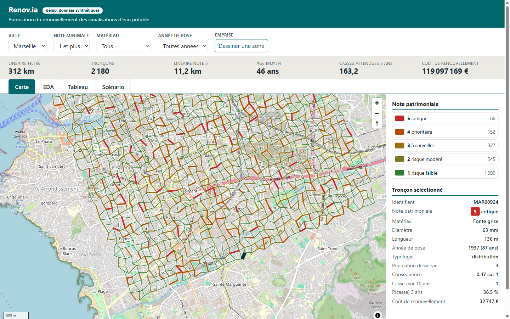

# Renov.ia — démonstration publique

**Aide à la décision patrimoniale pour les réseaux d'eau potable** : chaque tronçon de
canalisation reçoit une **probabilité calibrée de casse à 1, 3 et 5 ans** (machine learning),
croisée avec ses **conséquences** (typologie, diamètre, population desservie) pour produire une
**Note patrimoniale 1–5**, puis un **scénario de renouvellement optimisé sous contrainte de
budget**.

> ⚠️ **Démonstration sur données 100 % synthétiques.** Le réseau, les abonnés et l'historique de
> casses sont générés par simulation (`data/synthetic/generate.py`) : **aucune donnée réelle**
> (client, Veolia ou autre) n'est présente dans ce dépôt. Seul le **fond de carte** est réel : le
> réseau fictif y est posé pour donner une échelle urbaine lisible. Le processus générateur étant
> connu, il sert de vérité terrain : on vérifie que le pipeline ML retrouve les facteurs de risque
> injectés.
>
> Ce dépôt accompagne le mémoire RNCP40573 (Expert en informatique et systèmes d'information) —
> il illustre l'architecture et les choix techniques du produit Renov.ia, sans son périmètre
> industriel (multi-client, authentification, SIG réel).

## Aperçu



*Quatre villes, quatre patrimoines : chacune a son propre réseau simulé, son propre modèle et donc
ses propres priorités. Les cinq filtres (ville, note, matériau, année de pose, emprise dessinée à
la souris) définissent un périmètre unique, partagé par les quatre onglets — carte, exploration,
tableau et arbitrage budgétaire décrivent toujours le même sous-réseau.*

## Architecture

```
data/synthetic/<ville>/ ──► ml/ (features → XGBoost Poisson+offset → calibration → SHAP → backtest)
   4 réseaux simulés            │  scores.csv (probabilités calibrées 1/3/5 ans), un modèle par ville
                                ▼
                           domain/ (typologie, conséquence, Note 1–5 — Strategy/Factory/Adapter/Repository)
                                │
             optimizer/ ◄───────┤  (greedy risque/coût sous budget, formulation Poisson)
                                ▼
                           backend/ (FastAPI — passerelle REST, filtres partagés, projection WGS84)
                                ▼
                           frontend/ (React 18 + TS + Vite — carte MapLibre sur fond OSM, socle RGAA)
```

- **`data/synthetic/`** — un réseau fictif par ville (`villes.json` en décrit les paramètres).
  Le tracé suit une **trame de rues** orientée sur la direction dominante du bâti, avec des nœuds
  bruités et des mailles ajourées ; les coordonnées restent locales (mètres autour du centre), et
  c'est l'API qui les projette en WGS84. Chaque ville a son âge médian de patrimoine et un centre
  plus ancien que sa périphérie, d'où des profils de risque distincts.
- **`domain/`** — logique métier **pure** (aucun framework) : la matrice de risque
  P × C → Note 1–5. Quatre patterns structurent le code : *Strategy* (composantes de conséquence
  interchangeables), *Factory* (assemblage piloté par la config), *Adapter* (mapping des sources
  de données), *Repository* (accès aux tronçons abstrait).
- **`ml/`** — pipeline data science : feature engineering anti-fuite (split temporel strict,
  `fit_state` train→test), **XGBoost Poisson avec offset d'exposition** (log longueur×horizon :
  le modèle apprend un taux de casse /km/an), **calibration out-of-fold** (les scores sont de
  vraies probabilités), explicabilité **SHAP**, **backtesting temporel glissant** (métrique
  métier : capture linéaire @ 20 %). Un modèle par ville, comme le produit en entraîne un par
  collectivité.
- **`optimizer/`** — knapsack **glouton par ratio (risque évité × conséquence) / coût**,
  déterministe ; bénéfice en espérance de casses évitées Δμ = −ln(1−P) − μ_neuf, IC 95 %.
- **`backend/`** — API FastAPI sans logique métier : Repository → domaine → DTO. Un jeu de filtres
  unique (ville, notes, matériau, année de pose, emprise) alimente toutes les routes de lecture,
  et les agrégats d'exploration sont calculés côté serveur plutôt que dans le navigateur.
- **`frontend/`** — React : carte du risque sur fond OpenStreetMap, exploration graphique,
  tableau priorisé, arbitrage budgétaire. Socle **RGAA** : lien d'évitement, landmarks, onglets
  au clavier (flèches, Origine, Fin), étiquettes, `aria-live`, contrastes AA, la couleur toujours
  doublée d'un texte, lint `eslint-plugin-jsx-a11y` en CI.
- **`.ua/`** — graphe de connaissances du code (généré par l'outil *Understand Anything*),
  visualisable pour explorer l'architecture.

### Routes de l'API

| Route | Rôle |
|---|---|
| `GET /api/villes` | Villes disponibles et leur ancrage cartographique |
| `GET /api/materiaux` | Matériaux présents dans la ville (peuple le filtre) |
| `GET /api/kpi` | Six indicateurs du périmètre filtré |
| `GET /api/troncons` | Tronçons du périmètre, triés par risque |
| `GET /api/troncons/{id}` | Fiche d'un tronçon, hors filtres |
| `GET /api/geojson` | Tracé du périmètre en WGS84 |
| `GET /api/eda` | Six séries agrégées du périmètre |
| `POST /api/optimiser` | Scénario budgété sur le périmètre |

Toutes les routes de lecture partagent les paramètres `ville`, `notes`, `materiau`, `pose_max` et
`bbox`.

## Installation & exécution

Prérequis : Python ≥ 3.11, Node ≥ 20.

```bash
# 1. Dépendances Python
pip install -e ".[dev]"

# 2. (Re)générer les réseaux synthétiques puis les scores ML des 4 villes
python data/synthetic/generate.py          # --ville lyon pour n'en refaire qu'une
python ml/run_pipeline.py                  # idem

# 3. API (port 8000)
uvicorn backend.app.main:app --port 8000

# 4. Front (port 5173, proxy /api → 8000)
cd frontend && npm install && npm run dev
```

Les jeux générés et les scores sont **versionnés** : l'étape 2 n'est nécessaire que pour modifier
le générateur ou le modèle.

Vérifications qualité (les mêmes gates que la CI, cf. `.github/workflows/ci.yml`) :

```bash
ruff check .          # style PEP 8, imports, bugbear
mypy domain optimizer backend ml
pytest                # unitaires + contrat + e2e (32 tests)
```

## Déploiement

La démo tient dans **un seul conteneur** : l'image compile le front (Vite) puis le fait servir
par l'API FastAPI. Une seule origine, donc ni CORS ni URL d'API à configurer côté client.

L'image n'embarque pas le pipeline ML (`xgboost`, `shap`, `scikit-learn`) : les probabilités
calibrées sont pré-calculées et versionnées dans `data/synthetic/<ville>/scores.csv`. L'API les
lit, applique le domaine et l'optimiseur. Dépendances d'exécution dans `requirements-runtime.txt`.

```bash
docker build -t renovia-demo .
docker run --rm -p 8000:8000 renovia-demo    # http://localhost:8000
```

**Sur Render** (`render.yaml`) : *New > Blueprint*, sélectionner ce dépôt, déployer. Render lit
le blueprint, construit le `Dockerfile` et expose le service ; `autoDeploy` republie à chaque
push sur `main`. Sur l'offre gratuite, l'instance s'arrête après quelques minutes sans visite
et redémarre à la requête suivante : le premier affichage peut demander une minute, ce que
l'interface annonce au visiteur.

| Variable | Défaut | Rôle |
|---|---|---|
| `PORT` | `8000` | Port d'écoute (injecté par Render). |
| `CORS_ORIGINS` | `http://localhost:5173,http://127.0.0.1:5173` | Origines autorisées. Inutile en production (même origine), nécessaire en développement avec Vite. |

## Correspondance code ↔ blocs de compétences (RNCP40573)

| Bloc | Compétence illustrée | Où dans ce dépôt |
|---|---|---|
| **BC01** — Cadrage, conception et architecture SI | Architecture en couches (domaine pur / passerelle / UI), patterns GoF, contrats d'interface | `domain/` (Strategy, Factory, Adapter, Repository), `backend/app/dto.py`, ce README |
| **BC02** — Développement et intégration | Développement Python/TypeScript typé, API REST, front React accessible | `backend/`, `frontend/`, `optimizer/` |
| **BC03** — Industrialisation, qualité, sécurité | CI lint + typage + tests, pyramide de tests (unitaires → contrat → e2e, raccord Tab. 16), config PEP 8/ESLint | `.github/workflows/ci.yml` (raccord §8.5), `tests/`, `pyproject.toml`, `frontend/.eslintrc.cjs` |
| **BC05** — Big Data & Intelligence artificielle (option) | Modèle de comptage Poisson + offset, calibration, explicabilité SHAP, protocole de backtesting temporel (raccord chap. 9), optimisation sous contrainte | `ml/features/`, `ml/model/`, `ml/explain/`, `ml/backtest/`, `optimizer/` |

## Résultats sur le jeu synthétique

Le générateur injecte des facteurs de risque connus (fonte grise ancienne fragile, vieillissement
convexe, petits diamètres plus cassants). Le pipeline les **retrouve** :

- Importance SHAP : `matériau (encodage)` et `âge` dominent, devant `diamètre` — conforme au
  processus simulé. À Paris, dont le patrimoine est le plus ancien, c'est l'âge qui passe premier ;
- Backtest glissant (2014/2017/2020, horizon 3 ans) : **capture linéaire @ 20 % de 0,46 à 0,58**
  selon la ville et la fenêtre, soit plus du double d'une priorisation aléatoire (0,20) ;
- Les probabilités calibrées permettent à l'optimiseur d'annoncer des « casses évitées » en
  espérance, avec IC 95 %.

Les quatre patrimoines se distinguent nettement, ce qui donne au sélecteur de ville un sens
au-delà du fond de carte :

| Ville | Tronçons | Linéaire | Âge moyen | Casses observées |
|---|---:|---:|---:|---:|
| Marseille | 2 180 | 312 km | 46 ans | 0,166 casse/km/an |
| Lyon | 2 137 | 297 km | 51 ans | 0,200 casse/km/an |
| Bordeaux | 2 011 | 285 km | 52 ans | 0,199 casse/km/an |
| Paris | 2 343 | 302 km | 57 ans | 0,214 casse/km/an |

### Une note sur la calibration

La calibration isotonique est la référence, mais sa résolution dépend du nombre de **casses
observées**, pas du nombre de tronçons. Sur ce jeu (≈130 casses dans la fenêtre
d'entraînement), l'algorithme PAV ne produisait qu'une vingtaine de paliers : **20 probabilités
distinctes pour 2 180 tronçons, dont 105 ex æquo en tête**. Le niveau restait juste, mais l'ordre
disparaissait — or c'est l'ordre qui pilote la priorisation, et l'optimiseur départageait alors
les ex æquo par identifiant.

`ml/model/train.py` bascule donc sur une calibration **logistique (Platt)** sous 500 événements :
lisse et strictement monotone, elle préserve le classement du modèle. La capture @ 20 % gagne 3 à
5 points au passage. Au-dessus du seuil, l'isotonique reprend la main.

## Licence

[MIT](LICENSE) — © 2026 Mohamed Ahmed Vall. Démo pédagogique ; le produit industriel Renov.ia
(SOMEI) n'est pas couvert par ce dépôt.
