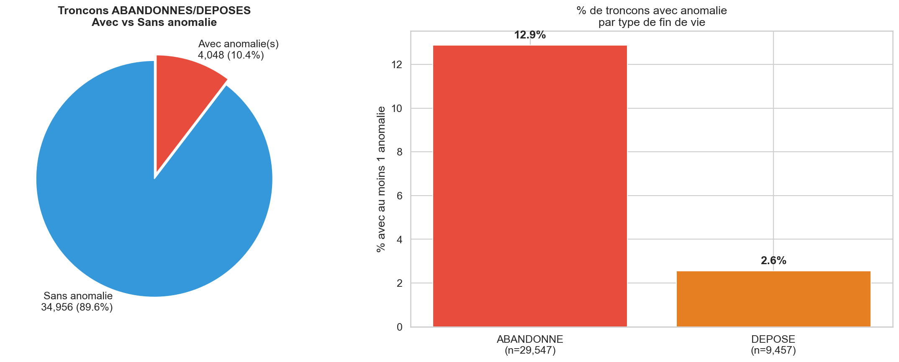
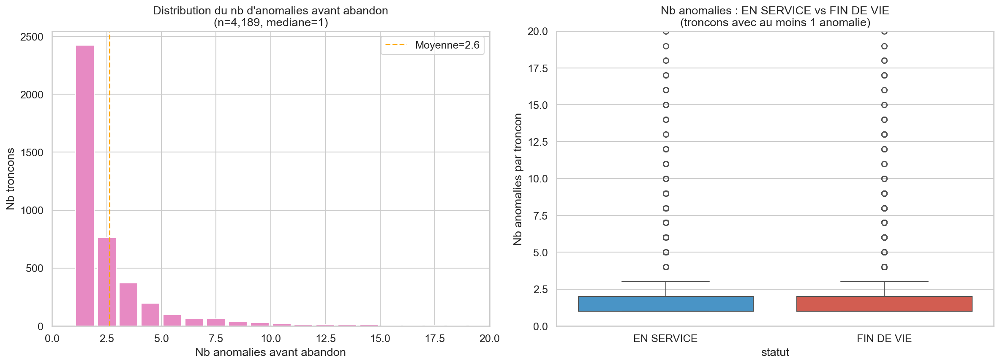
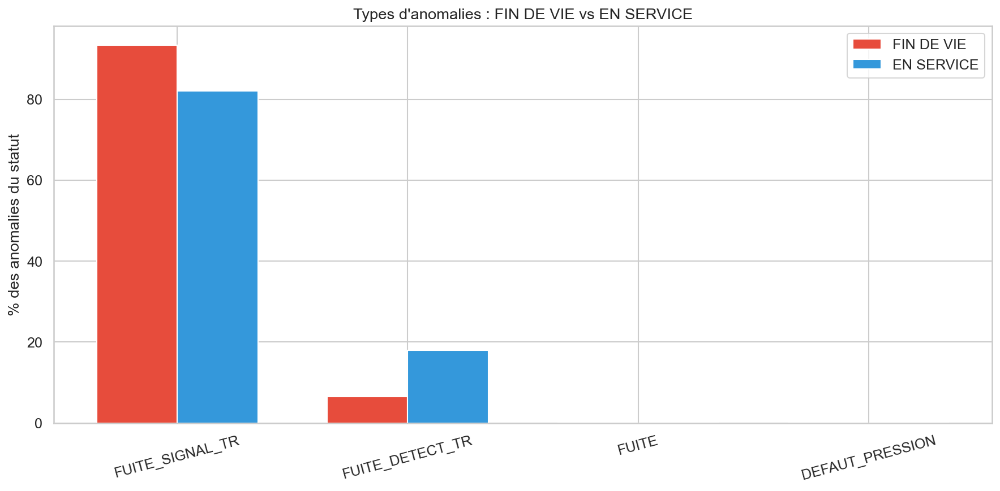
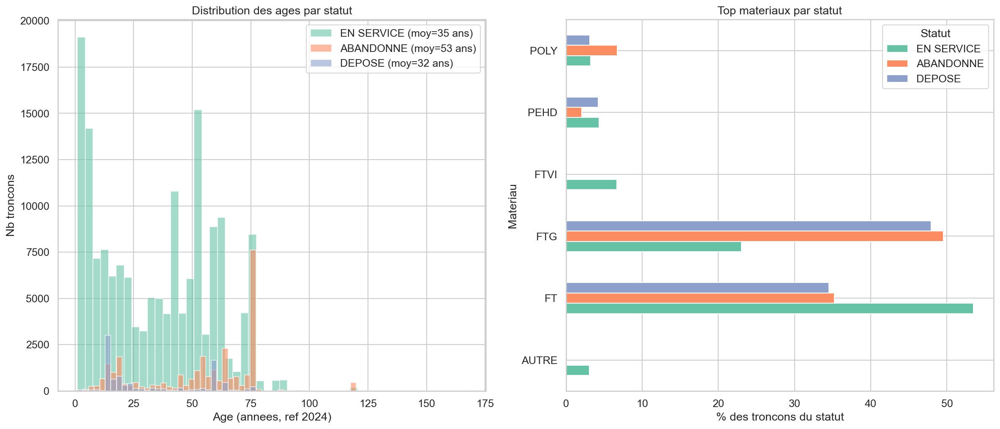
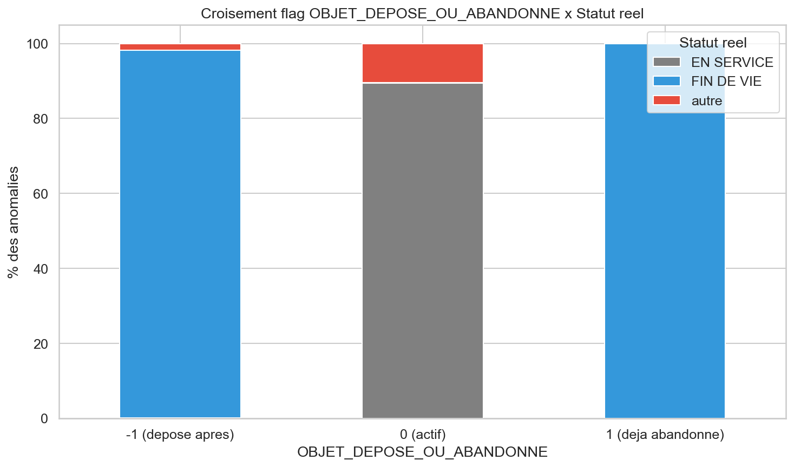
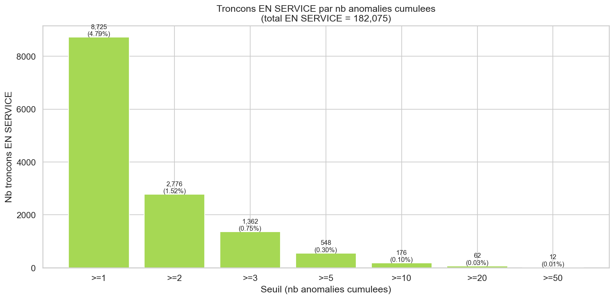

# Analyse : Correlation anomalies vs fin de vie

**Projet :** Prediction de casses de canalisations d'eau
**Annee de reference :** 2024
**Objectif :** Comprendre le lien entre anomalies et abandon/depose pour formuler correctement le modele predictif

---

## 1. Constat principal : 89.6% des abandons n'ont aucune anomalie

| | Nb troncons | % |
|--|-----------|---|
| Fin de vie **SANS** anomalie | 34,956 | **89.6%** |
| Fin de vie **AVEC** anomalie(s) | 4,048 | 10.4% |
| **Total fin de vie** | **39,004** | |

**Interpretation :** La grande majorite des canalisations sont abandonnees/deposees pour des raisons **non liees a des anomalies** : chantiers voirie, extension reseau, renouvellement preventif par cohorte age-materiau, mise aux normes.

---

## 2. Quand il y a des anomalies avant abandon

Sur les 4,189 troncons ayant eu des anomalies **avant** d'etre abandonnes (flag=-1) :

| Indicateur | Valeur |
|-----------|--------|
| Mediane anomalies avant abandon | **1** |
| Moyenne anomalies avant abandon | 2.6 |
| >= 3 anomalies avant abandon | 1,005 (24.0%) |
| >= 5 anomalies avant abandon | 436 (10.4%) |

**Interpretation :** La plupart des troncons sont abandonnes apres **1 seule anomalie**. Cela suggere que l'anomalie est souvent le **declencheur** de la decision, pas necessairement le signe d'une degradation avancee.

---

## 3. Types d'anomalies

### Sur les troncons FIN DE VIE :
- **93.5%** FUITE_SIGNAL_TR
- **6.5%** FUITE_DETECT_TR
- Quasi aucun autre type

### Sur les troncons EN SERVICE :
- **82.1%** FUITE_SIGNAL_TR
- **17.9%** FUITE_DETECT_TR
- Quelques types marginaux

**Interpretation :** Seuls les types **FUITE_SIGNAL_TR** et **FUITE_DETECT_TR** sont pertinents. Tous les autres types (DEFAUT_PRESSION, VETUSTE, etc.) sont negligeables et ne sont pas des signaux de fin de vie.

---

## 4. Profil des troncons abandonnes vs en service

| | EN SERVICE | ABANDONNE | DEPOSE |
|--|-----------|-----------|--------|
| Nb troncons | 182,075 | 29,547 | 9,457 |
| Age moyen | 43 ans | **54 ans** | 33 ans |
| Top materiau | FT (53%) | **FTG (50%)** | FTG (48%) |

**Interpretation :**
- Les **ABANDONNES** sont plus ages (54 ans) et surtout en **fonte grise (FTG)** -- materiau reconnu comme fragile
- Les **DEPOSES** sont plus jeunes (33 ans) -- probablement des remplacements dans le cadre de chantiers/travaux

---

## 5. Le flag OBJET_DEPOSE_OU_ABANDONNE

| Flag | Signification | Nb anomalies | Statut reel |
|------|-------------|-------------|------------|
| **-1** | Troncon depose/abandonne APRES l'anomalie | 10,992 | 98% FIN DE VIE |
| **0** | Troncon toujours actif | 19,781 | 99.9% EN SERVICE |
| **1** | Troncon deja abandonne (1 seul cas) | 1 | FIN DE VIE |

---

## 6. Troncons EN SERVICE a surveiller

| Seuil | Nb troncons | % du reseau |
|-------|-----------|------------|
| >= 1 anomalie | 8,725 | 4.79% |
| >= 3 anomalies | 1,362 | 0.75% |
| >= 5 anomalies | 548 | 0.30% |
| >= 10 anomalies | 176 | 0.10% |

---

## 7. Conclusions et questions pour le referent metier

### Ce que les donnees montrent :
1. **Les anomalies ne sont PAS le facteur principal des abandons** (90% des abandons sans anomalie)
2. **Les fuites (FUITE_SIGNAL_TR + FUITE_DETECT_TR) sont les seuls types pertinents** (99%+ des anomalies)
3. **Les abandons sont concentres sur la FTG agee** -- decision probablement basee sur age + materiau + politique de renouvellement
4. **1 seule fuite suffit souvent a declencher l'abandon** (mediane = 1)

### Questions cles pour le referent metier :

1. **Les 90% d'abandons sans anomalie** -- quelle est la logique derriere ?
   - Renouvellement systematique par cohorte (age + materiau) ?
   - Chantiers voirie / opportunite de travaux ?
   - Programme planifie pluriannuel ?

2. **Quand une fuite mene-t-elle a l'abandon vs simple reparation ?**
   - Seuil de nb de fuites ?
   - Cout cumule de reparation ?
   - Decision au cas par cas ?

3. **Les anomalies non predictibles** (coup de pelle, chantier tiers)
   - Sont-elles identifiables dans les donnees ?
   - Faut-il les exclure de l'apprentissage ?

4. **Quel est le bon objectif pour le modele ?**
   - Predire les futures fuites (proactif) ?
   - Predire le risque de degradation structurelle (score patrimonial) ?
   - Aider a la priorisation budgetaire (quel troncon renouveler en premier) ?

---

*Rapport genere automatiquement -- Analyse anomalies vs fin de vie (ref 2024)*
